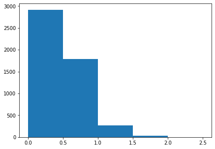
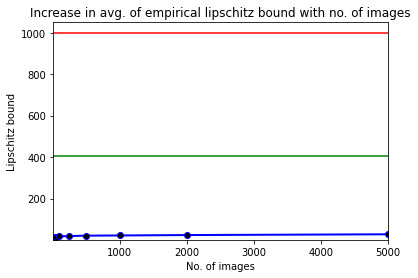

# LRNN: Lipschitz-Regularization-of-Neural-Networks (Overview)

## About

This work was carried out under the supervision of [Prof. Kunal Chaudhury](https://sites.google.com/site/kunalnchaudhury/home?authuser=0) at Indian Institute of Science, Bangalore. 

A mini implementation of this project can be found in this [repo](https://github.com/sarosijbose/Trivial-Lipschitz-Bound-Estimation).

## Setup

Please follow the instructions regarding splitting the fully connected networks and obtaining the respective tight bounds in the [LipSDP](https://github.com/arobey1/LipSDP) repository.

1. It is recommended to setup a fresh virtual environment first
```bash
python -m venv lrnn
source activate env/bin/activate
```
2. Install the required packages.

```bash
pip install -r requirements.txt
```
3. Run the ```main.py``` file in the ```code``` folder. Set the checkpoint paths accordingly.

4. All the checkpoints and other dependencies are present in the ```data``` folder.

## Results


A Histogram highlighting the distribution of empirical bounds obtained. The x-axis corresponds to the values of bounds obtained and the y-axis shows the frequency of the bounds within each bracket.  

---

The Table below highlightes how the measured lipschitz bound slowly approaches the true (empirical) lipschitz bound.

SL No. | Set Size (n) | Avg. Emp Value | Max. of Max Emp value
:---: | :---: | :---: | :---:
1 | 10 | 10.279830587380388 | 21.996063734099092
2 | 30 | 13.707607288527434 | 21.996063734099092
3 | 50 | 15.246720297071317 | 20.64324099543047
4 | 100 | 17.03347227003784 | 24.768061532731902
5 | 250 | 19.07323968615581 | 24.768061532731902
6 | 500 | 21.005331100841303 | 23.033706625601297
7 | 1000 | 21.927596934984948 | 24.378693337100803
8 | 2000 | 23.889638399197523 | 27.115284256708122
9 | 5000 | 27.59053004717982 | 27.930989694770535

---


The above diagram illustrates the existing gap between the trivial bound, tight (algorithmically obtained) bound and the true bound.

## Acknowledgements

Parts of the codebase has been borrowed from the [LipSDP](https://github.com/arobey1/LipSDP) repository. We are grateful to the authors for making their work publicly available. 
